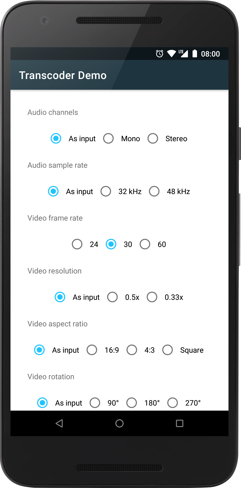
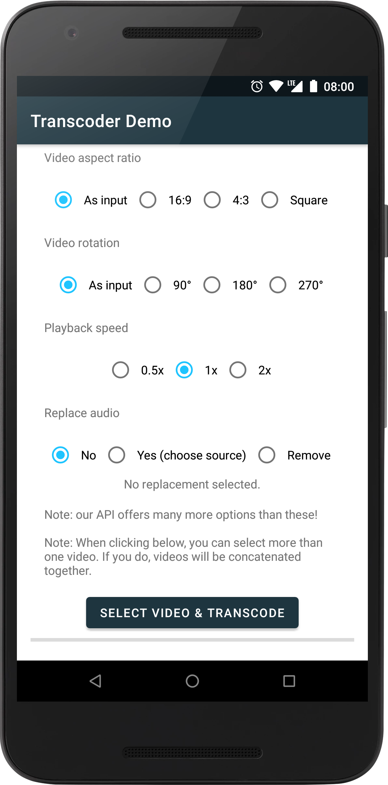

[](https://github.com/natario1/Transcoder/actions)
[](https://github.com/natario1/Transcoder/releases)
[](https://github.com/natario1/Transcoder/issues)

&#10240;  <!-- Hack to add whitespace -->

<p align="center">
  
</p>

*Looking for a powerful camera library to take videos? Take a look at our [CameraView](https://github.com/natario1/CameraView).*

*Need support, consulting, or have any other business-related question? Feel free to <a href="mailto:mat.iavarone@gmail.com">get in touch</a>.*

*Like the project, make profit from it, or simply want to thank back? Please consider [sponsoring me](https://github.com/sponsors/natario1)!*

# Transcoder

Transcodes and compresses video files into the MP4 format, with audio support, using hardware-accelerated 
Android codecs available on the device. Works on API 18+.

```groovy
implementation 'com.otaliastudios:transcoder:0.7.4'
```

- Fast transcoding to AAC/AVC
- Hardware accelerated
- Multithreaded
- Convenient, fluent API
- Concatenate multiple video and audio tracks [[docs]](https://natario1.github.io/Transcoder/docs/concatenation)
- Choose output size, with automatic cropping [[docs]](https://natario1.github.io/Transcoder/docs/track-strategies#video-size)
- Choose output rotation [[docs]](https://natario1.github.io/Transcoder/docs/advanced-options#video-rotation) 
- Choose output speed [[docs]](https://natario1.github.io/Transcoder/docs/advanced-options#video-speed)
- Choose output frame rate [[docs]](https://natario1.github.io/Transcoder/docs/track-strategies#other-options)
- Choose output audio channels [[docs]](https://natario1.github.io/Transcoder/docs/track-strategies#audio-strategies)
- Choose output audio sample rate [[docs]](https://natario1.github.io/Transcoder/docs/track-strategies#audio-strategies)
- Override frames timestamp, e.g. to slow down the middle part of the video [[docs]](https://natario1.github.io/Transcoder/docs/advanced-options#time-interpolation) 
- Error handling [[docs]](https://natario1.github.io/Transcoder/docs/events)
- Configurable validators to e.g. avoid transcoding if the source is already compressed enough [[docs]](https://natario1.github.io/Transcoder/docs/validators)
- Configurable video and audio strategies [[docs]](https://natario1.github.io/Transcoder/docs/track-strategies)

&#10240;  <!-- Hack to add whitespace -->

<p align="center">
  
</p>

&#10240;  <!-- Hack to add whitespace -->

*This project started as a fork of [ypresto/android-transcoder](https://github.com/ypresto/android-transcoder).
With respect to the source project, which misses most of the functionality listed above, 
we have also fixed a huge number of bugs and are much less conservative when choosing options 
that might not be supported. The source project will always throw - for example, accepting only 16:9,
AVC Baseline Profile videos - we prefer to try and let the codec fail if it wants to*.

## Support

If you like the project, make profit from it, or simply want to thank back, please consider 
[sponsoring me](https://github.com/sponsors/natario1) through the GitHub Sponsors program! 
You can have your company logo here, get private support hours or simply help me push this forward. 

Transcoder is trusted and supported by [ShareChat](https://sharechat.com/), a social media app with
over 100 million downloads. 

<p align="center">
  
</p>

Feel free to <a href="mailto:mat.iavarone@gmail.com">contact me</a> for support, consulting or any 
other business-related question.

## Setup

Please read the [official website](https://natario1.github.io/Transcoder) for setup instructions and documentation.
You might also be interested in our [changelog](https://natario1.github.io/Transcoder/about/changelog). 
Using Transcoder is extremely simple:

```java
Transcoder.into(filePath)
        .addDataSource(context, uri) // or...
        .addDataSource(filePath) // or...
        .addDataSource(fileDescriptor) // or...
        .addDataSource(dataSource)
        .setListener(new TranscoderListener() {
             public void onTranscodeProgress(double progress) {}
             public void onTranscodeCompleted(int successCode) {}
             public void onTranscodeCanceled() {}
             public void onTranscodeFailed(@NonNull Throwable exception) {}
        }).transcode()
```

Take a look at the demo app for a real example or keep reading below for documentation.