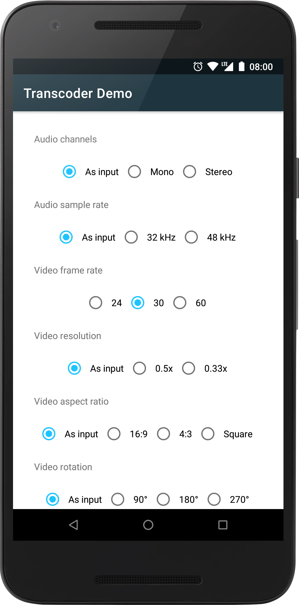
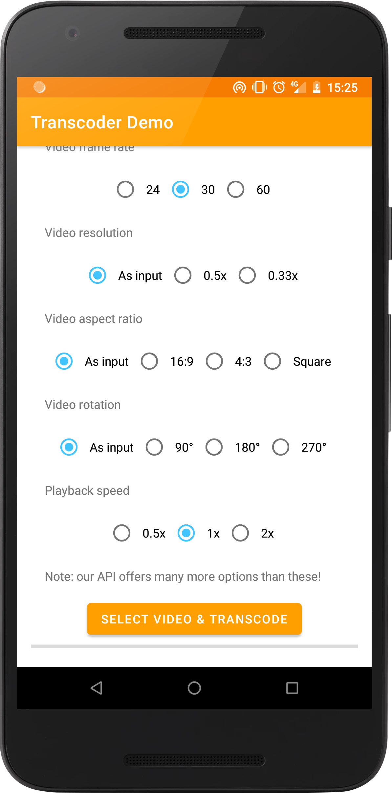

[](https://travis-ci.org/natario1/Transcoder)
[](https://github.com/natario1/Transcoder/releases)
[](https://github.com/natario1/Transcoder/issues)

&#10240;  <!-- Hack to add whitespace -->

<p align="center">
  
</p>

*Looking for a powerful camera library to take videos? Take a look at our [CameraView](https://github.com/natario1/CameraView).*

*Need support, consulting, or have any other business-related question? Feel free to <a href="mailto:mat.iavarone@gmail.com">get in touch</a>.*

*Like the project, make profit from it, or simply want to thank back? Please consider [sponsoring me](https://github.com/sponsors/natario1)!*

# Transcoder

Transcodes and compresses video files into the MP4 format, with audio support, using hardware accelerated Android codecs available on the device. Works on API 18+.

```groovy
implementation 'com.otaliastudios:transcoder:0.7.3'
```

- Fast transcoding to AAC/AVC
- Hardware accelerated
- Multithreaded
- Convenient, fluent API
- Concatenate multiple video and audio tracks [[docs]](#video-concatenation)
- Choose output size, with automatic cropping [[docs]](#video-size)
- Choose output rotation [[docs]](#video-rotation) 
- Choose output speed [[docs]](#video-speed)
- Choose output frame rate [[docs]](#other-options)
- Choose output audio channels [[docs]](#audio-strategies)
- Choose output audio sample rate [[docs]](#audio-strategies)
- Override frames timestamp, e.g. to slow down the middle part of the video [[docs]](#time-interpolation) 
- Error handling [[docs]](#listening-for-events)
- Configurable validators to e.g. avoid transcoding if the source is already compressed enough [[docs]](#validators)
- Configurable video and audio strategies [[docs]](#track-strategies)

&#10240;  <!-- Hack to add whitespace -->

<p align="center">
  
</p>

&#10240;  <!-- Hack to add whitespace -->

*This project started as a fork of [ypresto/android-transcoder](https://github.com/ypresto/android-transcoder).
With respect to the source project, which misses most of the functionality listed above, 
we have also fixed a huge number of bugs and are much less conservative when choosing options 
that might not be supported. The source project will always throw - for example, accepting only 16:9,
AVC Baseline Profile videos - we prefer to try and let the codec fail if it wants to*.

Using Transcoder in the most basic form is pretty simple:

```java
Transcoder.into(filePath)
        .addDataSource(context, uri) // or...
        .addDataSource(filePath) // or...
        .addDataSource(fileDescriptor) // or...
        .addDataSource(dataSource)
        .setListener(new TranscoderListener() {
             public void onTranscodeProgress(double progress) {}
             public void onTranscodeCompleted(int successCode) {}
             public void onTranscodeCanceled() {}
             public void onTranscodeFailed(@NonNull Throwable exception) {}
        }).transcode()
```

Take a look at the demo app for a real example or keep reading below for documentation.

## Sponsors

Transcoder is trusted and supported by [ShareChat](https://sharechat.com/), a social media app with over 100 million downloads. 

<p align="center">
  
</p>

Feel free to <a href="mailto:mat.iavarone@gmail.com">contact me</a> for support, consulting or any other business-related question.

## Setup

This library requires API level 18 (Android 4.3) or later.
If your app targets older versions, you can override the minSdkVersion by
adding this line to your manifest file:

```xml
<uses-sdk tools:overrideLibrary="com.otaliastudios.transcoder" />
```

In this case you should check at runtime that API level is at least 18, before
calling any method here.

## Data Sources

Starting a transcoding operation will require a source for our data, which is not necessarily
a `File`. The `DataSource` objects will automatically take care about releasing streams / resources,
which is convenient but it means that they can not be used twice.

#### `UriDataSource`

The Android friendly source can be created with `new UriDataSource(context, uri)` or simply
using `addDataSource(context, uri)` in the transcoding builder.

#### `FileDescriptorDataSource`

A data source backed by a file descriptor. Use `new FileDescriptorDataSource(descriptor)` or
simply `addDataSource(descriptor)` in the transcoding builder.

#### `FilePathDataSource`

A data source backed by a file absolute path. Use `new FilePathDataSource(path)` or
simply `addDataSource(path)` in the transcoding builder.

## Video Concatenation

As you might have guessed, you can use `addDataSource(source)` multiple times. All the source
files will be stitched together:

```java
Transcoder.into(filePath)
        .addDataSource(source1)
        .addDataSource(source2)
        .addDataSource(source3)
        // ...
```

In the above example, the three videos will be stitched together in the order they are added
to the builder. Once `source1` ends, we'll append `source2` and so on. The library will take care
of applying consistent parameters (frame rate, bit rate, sample rate) during the conversion.

This is a powerful tool since it can be used per-track:

```java
Transcoder.into(filePath)
        .addDataSource(source1) // Audio & Video, 20 seconds
        .addDataSource(TrackType.VIDEO, source2) // Video, 5 seconds
        .addDataSource(TrackType.VIDEO, source3) // Video, 5 seconds
        .addDataSource(TrackType.AUDIO, source4) // Audio, 10 sceonds
        // ...
```

In the above example, the output file will be 30 seconds long:

```kotlin
Video: | •••••••••••••••••• source1 •••••••••••••••••• | •••• source2 •••• | •••• source3 •••• |  
Audio: | •••••••••••••••••• source1 •••••••••••••••••• | •••••••••••••• source4 •••••••••••••• | 
```

And that's all you need to do.

### Automatic clipping

When concatenating data from multiple sources and on different tracks, it's common to have
a total audio length that is different than the total video length.

In this case, `Transcoder` will automatically clip the longest track to match the shorter.
For example:

```java
Transcoder.into(filePath)
        .addDataSource(TrackType.VIDEO, video1) // Video, 30 seconds
        .addDataSource(TrackType.VIDEO, video2) // Video, 30 seconds
        .addDataSource(TrackType.AUDIO, music) // Audio, 3 minutes
        // ...
```

In the situation above, we won't use the full music track, but only the first minute of it.

## Listening for events

Transcoding will happen on a background thread, but we will send updates through the `TranscoderListener`
interface, which can be applied when building the request:

```java
Transcoder.into(filePath)
        .setListenerHandler(handler)
        .setListener(new TranscoderListener() {
             public void onTranscodeProgress(double progress) {}
             public void onTranscodeCompleted(int successCode) {}
             public void onTranscodeCanceled() {}
             public void onTranscodeFailed(@NonNull Throwable exception) {}
        })
        // ...
```

All of the listener callbacks are called:

- If present, on the handler specified by `setListenerHandler()`
- If it has a handler, on the thread that started the `transcode()` call
- As a last resort, on the UI thread

#### `onTranscodeProgress`

This simply sends a double indicating the current progress. The value is typically between 0 and 1,
but can be a negative value to indicate that we are not able to compute progress (yet?).

This is the right place to update a ProgressBar, for example.

#### `onTranscodeCanceled`

The transcoding operation was canceled. This can happen when the `Future` returned by `transcode()`
is cancelled by the user.

#### `onTranscodeFailed`

This can happen in a number of cases and is typically out of our control. Input options might be
wrong, write permissions might be missing, codec might be absent, input file might be not supported
or simply corrupted.

You can take a look at the `Throwable` being passed to know more about the exception.

#### `onTranscodeCompleted`

Transcoding operation did succeed. The success code can be:

|Code|Meaning|
|----|-------|
|`Transcoder.SUCCESS_TRANSCODED`|Transcoding was executed successfully. Transcoded file was written to the output path.|
|`Transcoder.SUCCESS_NOT_NEEDED`|Transcoding was not executed because it was considered **not needed** by the `Validator`.|

Keep reading [below](#validators) to know about `Validator`s.

## Validators

Validators tell the engine whether the transcoding process should start or not based on the status
of the audio and video track.

```java
Transcoder.into(filePath)
        .setValidator(validator)
        // ...
```

This can be used, for example, to:

- avoid transcoding when video resolution is already OK with our needs
- avoid operating on files without an audio/video stream
- avoid operating on files with an audio/video stream

Validators should implement the `validate(TrackStatus, TrackStatus)` and inspect the status for video
and audio tracks. When `false` is returned, transcoding will complete with the `SUCCESS_NOT_NEEDED` status code.
The TrackStatus enum contains the following values:

|Value|Meaning|
|-----|-------|
|`TrackStatus.ABSENT`|This track was absent in the source file.|
|`TrackStatus.PASS_THROUGH`|This track is about to be copied as-is in the target file.|
|`TrackStatus.COMPRESSING`|This track is about to be processed and compressed in the target file.|
|`TrackStatus.REMOVING`|This track will be removed in the target file.|

The `TrackStatus` value depends on the [track strategy](#track-strategies) that was used.
We provide a few validators that can be injected for typical usage.

#### `DefaultValidator`

This is the default validator and it returns true when any of the track is `COMPRESSING` or `REMOVING`.
In the other cases, transcoding is typically not needed so we abort the operation.

#### `WriteAlwaysValidator`

This validator always returns true and as such will always write to target file, no matter the track status,
presence of tracks and so on. For instance, the output container file might have no tracks.

#### `WriteVideoValidator`

A Validator that gives priority to the video track. Transcoding will not happen if the video track does not need it,
even if the audio track might need it. If reducing file size is your only concern, this can avoid compressing
files that would not benefit so much from compressing the audio track only.

## Track Strategies

Track strategies return options for each track (audio or video) for the engine to understand **how**
and **if** this track should be transcoded, and whether the whole process should be aborted.

```java
Transcoder.into(filePath)
        .setVideoTrackStrategy(videoStrategy)
        .setAudioTrackStrategy(audioStrategy)
        // ...
```

The point of `TrackStrategy` is to inspect the input `android.media.MediaFormat` and return
the output `android.media.MediaFormat`, filled with required options.

This library offers track specific strategies that help with audio and video options (see
[Audio Strategies](#audio-strategies) and [Video Strategies](#video-strategies)).
In addition, we have a few built-in strategies that can work for both audio and video:

#### `PassThroughTrackStrategy`

A TrackStrategy that asks the encoder to keep this track as is, by returning the same input
format. Note that this is risky, as the input track format might not be supported my the MP4 container.

This will set the `TrackStatus` to `TrackStatus.PASS_THROUGH`.

#### `RemoveTrackStrategy`

A TrackStrategy that asks the encoder to remove this track from the output container, by returning null.
For instance, this can be used as an audio strategy to remove audio from video/audio streams.

This will set the `TrackStatus` to `TrackStatus.REMOVING`.

## Audio Strategies

The default internal strategy for audio is a `DefaultAudioStrategy`, which converts the
audio stream to AAC format with the specified number of channels and [sample rate](#audio-resampling).

```java
DefaultAudioStrategy strategy = DefaultAudioStrategy.builder()
        .channels(DefaultAudioStrategy.CHANNELS_AS_INPUT)
        .channels(1)
        .channels(2)
        .sampleRate(DefaultAudioStrategy.SAMPLE_RATE_AS_INPUT)
        .sampleRate(44100)
        .sampleRate(30000)
        .bitRate(DefaultAudioStrategy.BITRATE_UNKNOWN)
        .bitRate(bitRate)
        .build();

Transcoder.into(filePath)
        .setAudioTrackStrategy(strategy)
        // ...
```

Take a look at the source code to understand how to manage the `android.media.MediaFormat` object.

## Video Strategies

The default internal strategy for video is a `DefaultVideoStrategy`, which converts the
video stream to AVC format and is very configurable. The class helps in defining an output size.
If the output size does not match the aspect ratio of the input stream size, `Transcoder` will
crop part of the input so it matches the final ratio.

### Video Size

We provide helpers for common tasks:

```java
DefaultVideoStrategy strategy;

// Sets an exact size. If aspect ratio does not match, cropping will take place.
strategy = DefaultVideoStrategy.exact(1080, 720).build();

// Keeps the aspect ratio, but scales down the input size with the given fraction.
strategy = DefaultVideoStrategy.fraction(0.5F).build();

// Ensures that each video size is at most the given value - scales down otherwise.
strategy = DefaultVideoStrategy.atMost(1000).build();

// Ensures that minor and major dimension are at most the given values - scales down otherwise.
strategy = DefaultVideoStrategy.atMost(500, 1000).build();
```

In fact, all of these will simply call `new DefaultVideoStrategy.Builder(resizer)` with a special
resizer. We offer handy resizers:

|Name|Description|
|----|-----------|
|`ExactResizer`|Returns the exact dimensions passed to the constructor.|
|`AspectRatioResizer`|Crops the input size to match the given aspect ratio.|
|`FractionResizer`|Reduces the input size by the given fraction (0..1).|
|`AtMostResizer`|If needed, reduces the input size so that the "at most" constraints are matched. Aspect ratio is kept.|
|`PassThroughResizer`|Returns the input size unchanged.|

You can also group resizers through `MultiResizer`, which applies resizers in chain:

```java
// First scales down, then ensures size is at most 1000. Order matters!
Resizer resizer = new MultiResizer();
resizer.addResizer(new FractionResizer(0.5F));
resizer.addResizer(new AtMostResizer(1000));

// First makes it 16:9, then ensures size is at most 1000. Order matters!
Resizer resizer = new MultiResizer();
resizer.addResizer(new AspectRatioResizer(16F / 9F));
resizer.addResizer(new AtMostResizer(1000));
```

This option is already available through the DefaultVideoStrategy builder, so you can do:

```java
DefaultVideoStrategy strategy = new DefaultVideoStrategy.Builder()
        .addResizer(new AspectRatioResizer(16F / 9F))
        .addResizer(new FractionResizer(0.5F))
        .addResizer(new AtMostResizer(1000))
        .build();
```

### Other options

You can configure the `DefaultVideoStrategy` with other options unrelated to the video size:

```java
DefaultVideoStrategy strategy = new DefaultVideoStrategy.Builder()
        .bitRate(bitRate)
        .bitRate(DefaultVideoStrategy.BITRATE_UNKNOWN) // tries to estimate
        .frameRate(frameRate) // will be capped to the input frameRate
        .keyFrameInterval(interval) // interval between key-frames in seconds
        .build();
```

## Advanced Options

### Video rotation

You can set the output video rotation with the `setRotation(int)` method. This will apply a clockwise
rotation to the input video frames. Accepted values are `0`, `90`, `180`, `270`:

```java
Transcoder.into(filePath)
        .setVideoRotation(rotation) // 0, 90, 180, 270
        // ...
```

### Time interpolation

We offer APIs to change the timestamp of each video and audio frame. You can pass a `TimeInterpolator`
to the transcoder builder to be able to receive the frame timestamp as input, and return a new one
as output.

```java
Transcoder.into(filePath)
        .setTimeInterpolator(timeInterpolator)
        // ...
```

As an example, this is the implementation of the default interpolator, called `DefaultTimeInterpolator`,
that will just return the input time unchanged:

```java
@Override
public long interpolate(@NonNull TrackType type, long time) {
    // Receive input time in microseconds and return a possibly different one.
    return time;
}
```

It should be obvious that returning invalid times can make the process crash at any point, or at least
the transcoding operation fail.

### Video speed

We also offer a special time interpolator called `SpeedTimeInterpolator` that accepts a `float` parameter
and will modify the video speed.

- A speed factor equal to 1 will leave speed unchanged
- A speed factor < 1 will slow the video down
- A speed factor > 1 will accelerate the video

This interpolator can be set using `setTimeInterpolator(TimeInterpolator)`, or, as a shorthand, 
using `setSpeed(float)`:

```java
Transcoder.into(filePath)
        .setSpeed(0.5F) // 0.5x
        .setSpeed(1F) // Unchanged
        .setSpeed(2F) // Twice as fast
        // ...
```

### Audio stretching

When a time interpolator alters the frames and samples timestamps, you can either remove audio or
stretch the audio samples to the new length. This is done through the `AudioStretcher` interface:

```java
Transcoder.into(filePath)
        .setAudioStretcher(audioStretcher)
        // ...
```

The default audio stretcher, `DefaultAudioStretcher`, will:

- When we need to shrink a group of samples, cut the last ones
- When we need to stretch a group of samples, insert noise samples in between

Please take a look at the implementation and read class documentation.

### Audio resampling

When a sample rate different than the input is specified (by the `TrackStrategy`, or, when using the
default audio strategy, by `DefaultAudioStategy.Builder.sampleRate()`), this library will automatically
perform sample rate conversion for you. 

This operation is performed by a class called `AudioResampler`. We offer the option to pass your
own resamplers through the transcoder builder:

```java
Transcoder.into(filePath)
        .setAudioResampler(audioResampler)
        // ...
```

The default audio resampler, `DefaultAudioResampler`, will perform both upsampling and downsampling
with very basic algorithms (drop samples when downsampling, repeat samples when upsampling).
Upsampling is generally discouraged - implementing a real upsampling algorithm is probably out of
the scope of this library.

Please take a look at the implementation and read class documentation.

## Compatibility

As stated pretty much everywhere, **not all codecs/devices/manufacturers support all sizes/options**.
This is a complex issue which is especially important for video strategies, as a wrong size can lead
to a transcoding error or corrupted file.

Android platform specifies requirements for manufacturers through the [CTS (Compatibility test suite)](https://source.android.com/compatibility/cts).
Only a few codecs and sizes are **strictly** required to work.

We collect common presets in the `DefaultVideoStrategies` class:

```java
Transcoder.into(filePath)
        .setVideoTrackStrategy(DefaultVideoStrategies.for720x1280()) // 16:9
        .setVideoTrackStrategy(DefaultVideoStrategies.for360x480()) // 4:3
        // ...
```

## License

This project is licensed under Apache 2.0. It consists of improvements over
the [ypresto/android-transcoder](https://github.com/ypresto/android-transcoder)
project which was licensed under Apache 2.0 as well:

```
Copyright (C) 2014-2016 Yuya Tanaka

Licensed under the Apache License, Version 2.0 (the "License");
you may not use this file except in compliance with the License.
You may obtain a copy of the License at

    http://www.apache.org/licenses/LICENSE-2.0

Unless required by applicable law or agreed to in writing, software
distributed under the License is distributed on an "AS IS" BASIS,
WITHOUT WARRANTIES OR CONDITIONS OF ANY KIND, either express or implied.
See the License for the specific language governing permissions and
limitations under the License.
```
